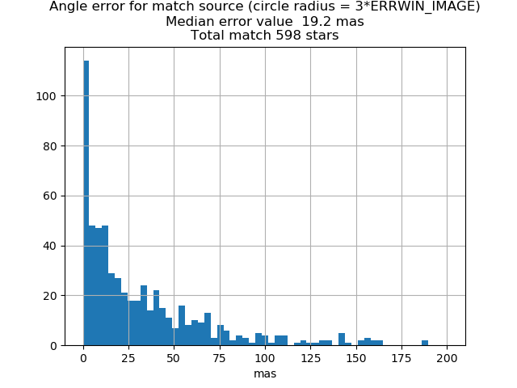
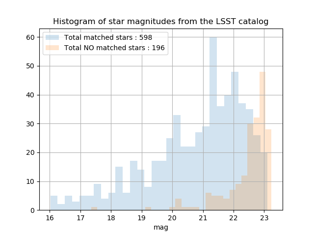

# Astrometry check

With function "check\_catalog\_stack()" in astrometry.py module

## Inputs
* path butler with a cat_temp.txt file to define true star catalog in ra dec
* file to catalog output stage 1, object in catalog are in pixel unit
* file detrended frame output stage 1, contains WCS (pixel <=> ra,dec IRCS)
* select photometry band 

## Processing check

0. convert star catalog output stage 1 in ra, dec with WCS from detrended frame
1. reduce true star catalog under magnitude 27
2. remove true star catalog outside the detrended frame field of view
3. loop on star only (not the galaxies) in detrended frame
    1. define radius error around postion of star as 3*max(err_x, err_y), => error circle
    2. convert position star in ra, dec with WCS
    3. search stars in true catalog in error circle and select the most brightest, if no star is in ellipse association is failed (possible improvement by selecting the star with the closest magnitude to the estimate )
    4. compute error position ra,  dec and angular distance and append to a list

## Ouputs
1. plot histogram error: ra, dec and  angular distance
2. plot histogram of a failed association by magnitude


## Use, very crude

Fill in the following variables directly in __main__ function :
1. **path** for path of butler (contains true star catalog in LSST format, by default "cat_temp.txt")
2. **frame** for image output stage 1 
3. **cat** for catalog output stage 1 
and call module as a script

```
python astrometry.py 
```

## Plot examples





